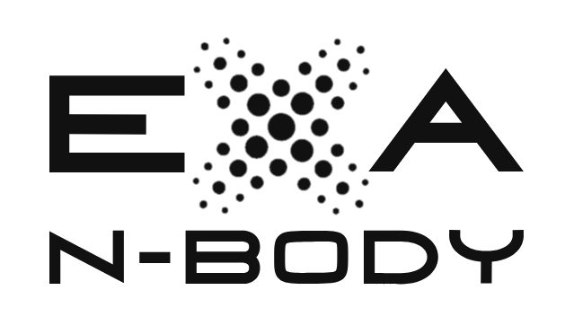

# exaNBody

exaNBody is a software platform to build-up numerical simulations solving N-Body like problems.
Typical applications include Molecular Dynamics, particle based fluid simulations using methods such as Smooth Particle Hydrodynamics (SPH) or rigid body simulations using methods such as Discrete Element Method (DEM).
It uses standard and widely adopted technologies such as C++17, YAML, OpenMP and Cuda.
